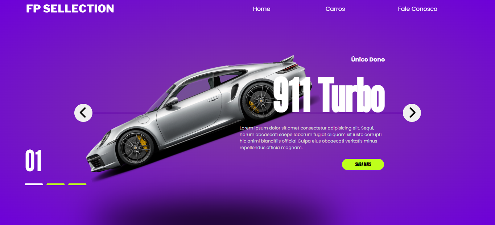
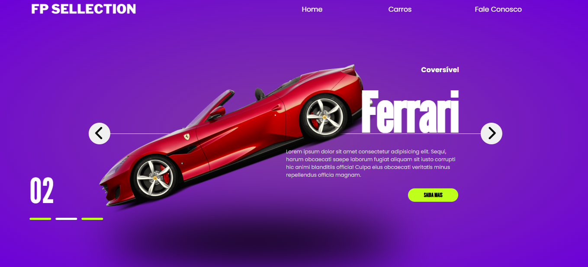
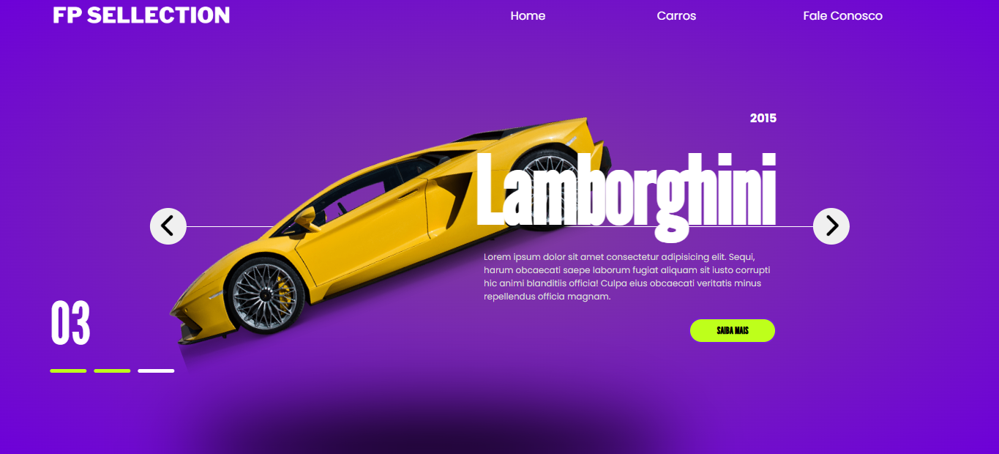

<h1 align="center"> Car Store </h1>

Loja online moderna com animações suaves e design responsivo para uma concessionária de carros de luxo.

    <a href="#-tecnologias">Tecnologias</a>&nbsp;&nbsp;&nbsp;|&nbsp;&nbsp;&nbsp;
    <a href="#-projeto">Projeto</a>&nbsp;&nbsp;&nbsp; |&nbsp;&nbsp;&nbsp;
    <a href="#-licença">Licença</a>&nbsp;&nbsp;&nbsp; |&nbsp;&nbsp;&nbsp;

 

    
    
    

## 🚀 Tecnologias
Esse projeto foi desenvolvido com as seguintes tecnologias:

- HTML & CSS
- JavaScript
- Git & Github

## 💻 Projeto
Projeto de interface moderna para exibição de carros de luxo, com design responsivo, animações e navegação interativa.

## Licença
Esse projeto está sob a licença MIT.